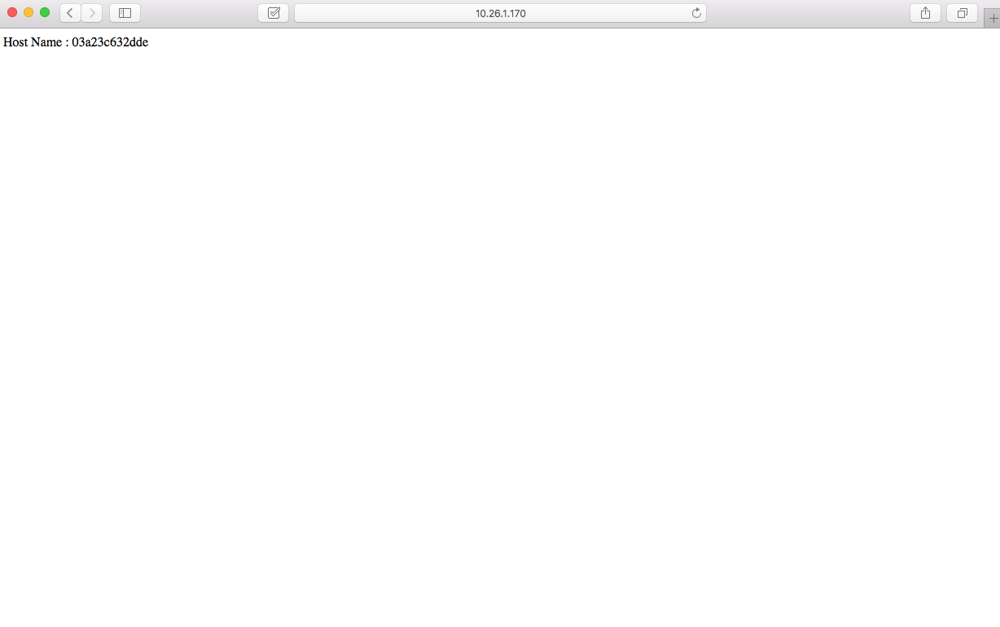
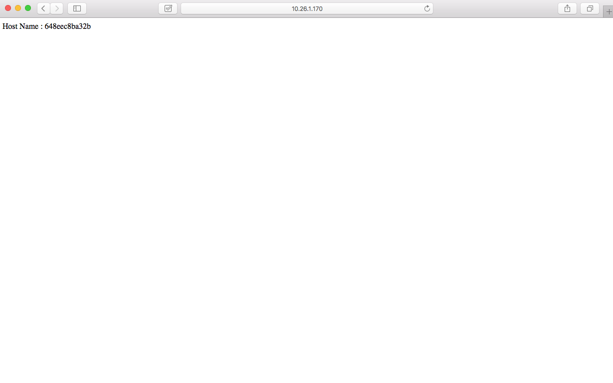

## Docker Swarm + Nginx 佈署與配置

Docker Swarm 是 Docker 官方在2014年12月初發佈的一套管理 Docker 叢集的工具。透過 swarm manager 管理多個 swarm nodes ，使用者只需藉由 swarm manager 下達指令，接著 swarm manager 會自動選擇一個 swarm node 來運行 container。本範例結合 nginx 提供的 proxy 與 load balancing (負載平衡)實作一個簡易架構的 web service。


### Ubuntu Docker Swarm 安裝與部屬

簡易節點配置如下：

| IP Address    | Role   |
|:-------------:|:------:|
| 192.168.100.83| master |
| 192.168.100.84| node1  |
| 192.168.100.85| node2  |

> 這個部份 master 為主要控制節點，node 為應用程式工作節點。

#### master:

首先，安裝 docker 環境，可以透過執行 `install.sh` 安裝。

```
$ ./install.sh
```
> 若已經安裝過 docker 環境，請忽略此步驟。

接下來，先利用下列指令，建立一個 docker-swarm 叢集：

```
$ docker run --rm swarm create
```

> 這個步驟完成以後，系統會顯示一組 cluster id ，請記錄下來，以便後續步驟所使用。

#### node:

開啟 node 節點的 terminal ，透過下列指令執行 swarm image 並將 swarm manager 與節點連結，建立 swarm 與 node 之間溝通通道：

```
$ docker run -d swarm join --addr=192.168.100.84:2375 token://<cluster_id>
```

> + cluster_id 為前一步驟所產生的 ID。
> + 這個命令每個 nodes 皆需執行，否則 master 無法取得該節點資訊。

開啟 `/etc/default/docker` 並將下列程式碼於檔案最下方加入：

```
DOCKER_OPTS="-H 192.168.100.84:2375 -H unix:///var/run/docker.sock"
```

#### master:

最後，回到 master 執行下列指令：

```
docker run -t -p 2375:2375 -t swarm manage token://<cluster_id>
```

安裝完成以後，可以透過 `info` 指令觀看所有 nodes 狀況：

```
$ docker -H :2375 info

ontainers: 5
 Running: 4
 Paused: 0
 Stopped: 1
Images: 4
Server Version: swarm/1.1.2
Role: primary
Strategy: spread
Filters: health, port, dependency, affinity, constraint
Nodes: 2
 docker-node1: 192.168.100.84:2375
  └ Status: Healthy
  └ Containers: 2
  └ Reserved CPUs: 0 / 2
  └ Reserved Memory: 0 B / 4.054 GiB
  └ Labels: executiondriver=native-0.2, kernelversion=3.13.0-63-generic, operatingsystem=Ubuntu 14.04.3 LTS, storagedriver=devicemapper
  └ Error: (none)
  └ UpdatedAt: 2016-02-23T08:57:57Z
 docker-node2: 192.168.100.85:2375
  └ Status: Healthy
  └ Containers: 3
  └ Reserved CPUs: 0 / 2
  └ Reserved Memory: 0 B / 4.054 GiB
  └ Labels: executiondriver=native-0.2, kernelversion=3.13.0-63-generic, operatingsystem=Ubuntu 14.04.3 LTS, storagedriver=devicemapper
  └ Error: (none)
  └ UpdatedAt: 2016-02-23T08:57:44Z
Plugins:
 Volume:
 Network:
Kernel Version: 3.13.0-63-generic
Operating System: linux
Architecture: amd64
CPUs: 4
Total Memory: 8.107 GiB
Name: d7ca6a4fdc10
```

> 可以從 docker hub 取得更多 [swarm](https://hub.docker.com/_/swarm/) 相關指令： <br />
> $ docker -H tcp://\<swarm_ip:swarm_port\> run ...<br />
> $ docker -H tcp://\<swarm_ip:swarm_port\> ps ...<br />
> $ docker -H tcp://\<swarm_ip:swarm_port\> logs ...<br />

### Nginx 安裝與配置

####master:

首先，安裝 Nginx 套件：

```
sudo apt-get install nginx
```

接下來，將下列程式碼加入 `/etc/nginx/sites-enabled/default` 中：

```
upstream nodes {
    server 192.168.100.84:8080 weight=1; #權重 = 1
    server 192.168.100.85:8080 weight=2; #權重 = 2
}
...
server {
	location / {
		proxy_pass http://nodes;	
	}
}
...
```

> + 這個部分需要特別注意， upstream nodes 加在 server 外，proxy_pass 加在 server 中的 location / ，而 server 與 location / 為原本檔案所設置，並非另外加入。 
> + nginx 預設 load balancing 演算法為 round robin ，也可以透過上述方式調整每個 nodes 所分配到的權重。

最後，將測試網頁透過 master 安裝在 node 上。

```
docker -H :2375 run -d -p 8080:80 cijie/haproxy-web-example:1.0.0
```

> 執行完後，可至該 node 上透過 `docker ps` 檢視 image。

以上設定完以後，就可以打開瀏覽器做測試。只需在瀏覽器上輸入你的 master ip 即可檢視結果。



(重新整理)



> 系統會依照你所設定的 nodes 與分配的權重自動將請求導向個節點。
